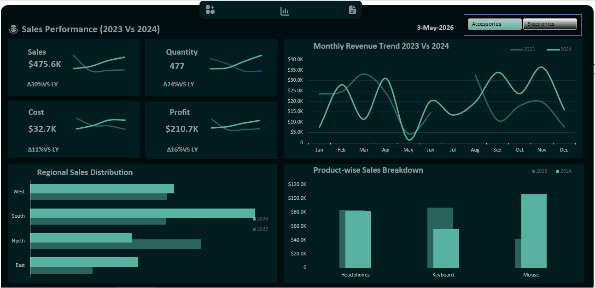

# Sales Performance Dashboard (2023 vs 2024)

An interactive sales dashboard that compares 2023 and 2024 across sales, quantity, cost, profit, regions and products.

*Recreated by:* Felix Ukamaka Peace
[LinkedIn](https://www.linkedin.com/in/ukamaka-felix-4160993ab) | [Portfolio](https://felix-ukamaka-peace.lovable.app) | [Read the article on Medium](https://medium.com/@beautyfelix6/my-data-analytics-portfolio-3-dashboards-3-business-stories-6b60c470a729)

## Credit
The original dashboard design belongs to *Freedom Oboh*. I rebuilt it from scratch as a practice project to improve my dashboard skills. All design credit goes to him.

## Project Overview
Businesses need to know if sales are growing and where the growth comes from. This dashboard puts two years side by side, so it is easy to see what went up, what went down and where to focus next.

## How I Rebuilt It
I started by studying the dataset to understand its fields: sales, quantity, cost and profit by month, region and product for 2023 and 2024.I cleaned the data in Power Query before building the charts. The cards show each total and its change versus last year. The line chart compares monthly revenue across the two years. The region and product charts show where the growth came from. The Accessories and Electronics buttons filter the whole page.

## Business Questions
1. How did sales, quantity, cost and profit change compared with last year?
2. Which months did best in each year?
3. Which regions bring in the most sales?
4. Which products grew and which fell?

## Key Insights
These figures are for the Accessories view. Chart values are approximate.
- *Sales* reached *$475.6K, up **30%* on last year.
- *Quantity* was *477 units, up **24%*.
- *Cost* was *$32.7K, up only **11%*.
- *Profit* was *$210.7K, up **16%*.
- *Monthly trend:* 2024 revenue went up and down more than 2023. It peaked in November at about $36K and was lowest in May.
- *Regions:* South is the strongest region in 2024. West and East also grew, but North fell.
- *Products:* Mouse sales more than doubled, from about $42K to about $105K. Headphones stayed about the same, and Keyboard sales fell from about $87K to about $56K.

## Recommendations
- Keep investing in the Mouse range, which drove most of the growth.
- Find out why Keyboard sales fell. It could be price, stock or competition.
- Look into why North fell, and learn from what works in the South.
- Plan stock and offers around the weak month of May and the strong month of November.

## Tools Used
- Excel (dashboard)
- Power Query (data cleaning)

## Contact
Felix Ukamaka Peace | beautyfelix6@gmail.com
